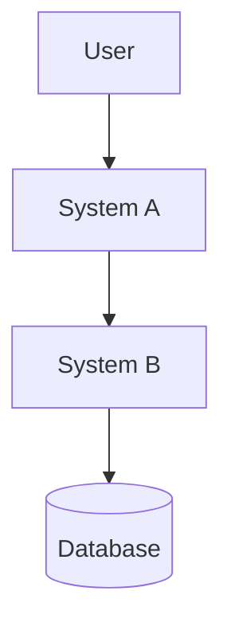
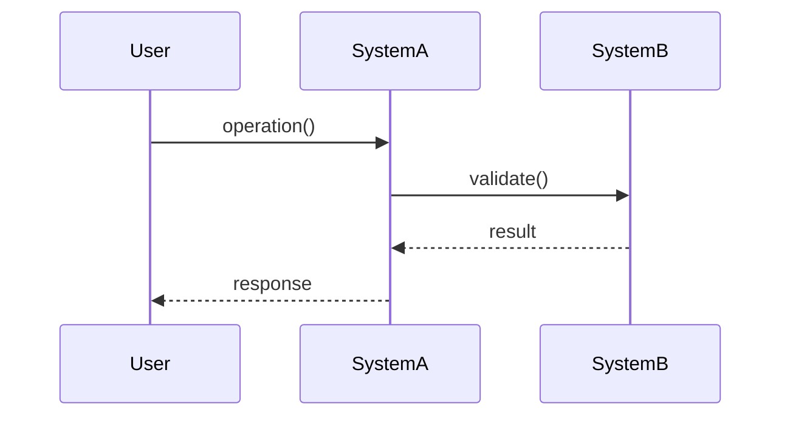

I have a complete specification following RootSpec v4.4.1.

Please read 00.SPEC_FRAMEWORK.md to understand the framework structure.

## My Specification

**Location:** {{SPEC_DIR}}/

**Systems (from 04.SYSTEMS/):**
{{#EACH SYSTEMS}}
- {{ITEM}}
{{/EACH}}
{{#IF NO_SYSTEMS}}
(No systems found - ensure you have Level 4 system specifications)
{{/IF}}

## What I Need

Derive a **Technical Design Document** from my Level 4 Systems specifications.

The output should include:
1. **Architecture diagrams** - System interconnections (Mermaid syntax)
2. **API specifications** - Endpoint definitions with contracts
3. **Data models** - Entity schemas and relationships
4. **Integration contracts** - Inter-system communication patterns
5. **Sequence diagrams** - Key flow visualizations

## Instructions

### PHASE 1: ANALYZE SYSTEMS

Read all Level 4 system files:

1. Start with `{{SPEC_DIR}}/04.SYSTEMS/SYSTEMS_OVERVIEW.md` to understand:
   - How systems interconnect
   - System boundaries and responsibilities
   - Cross-system dependencies

2. Read each individual system file in `{{SPEC_DIR}}/04.SYSTEMS/*.md`:
   - Extract entities and data structures
   - Identify rules and state transitions
   - Note inter-system relationships
   - Understand system responsibilities

3. Present your analysis:
   - List all systems with their primary responsibilities
   - Map system interconnections
   - Identify shared entities/concepts
   - Note any architectural patterns

Wait for confirmation before proceeding to Phase 2.

### PHASE 2: ARCHITECTURE DIAGRAMS

Create system architecture diagram in Mermaid syntax:

**Required elements:**
- All systems as boxes/components
- Data flow between systems
- External dependencies
- User interaction points

**Format:**


**Annotations:**
- Add `@spec_source: 04.SYSTEMS/SYSTEMS_OVERVIEW.md` comment
- Reference specific section/line from source spec

### PHASE 3: API SPECIFICATIONS

For each system that exposes APIs:

**Extract from system rules:**
- What operations does the system perform?
- What inputs does it require?
- What outputs does it produce?
- What validations are enforced?

**API Specification format:**

```
Endpoint: POST /api/system-a/operation
Source: @spec_source 04.SYSTEMS/SYSTEM_A.md#operations

Description: [Derived from system responsibility]

Request:
{
  "field": "type (from system entities)"
}

Response:
{
  "result": "type (from system state)"
}

Validation Rules: [From system rules section]
Error Cases: [From system failure modes]
```

### PHASE 4: DATA MODELS

Derive entity schemas from system documentation:

**For each entity mentioned in systems:**

```typescript
// @spec_source: 04.SYSTEMS/SYSTEM_NAME.md#entities
interface EntityName {
  field1: Type;  // From system entity description
  field2: Type;  // Referenced in system rules
}
```

**Relationships:**
- Map entity relationships across systems
- Define foreign keys for shared entities
- Document cardinality (1:1, 1:N, N:M)

### PHASE 5: INTEGRATION CONTRACTS

Define how systems communicate:

**For each inter-system relationship:**

```
Contract: System A → System B
Source: @spec_source 04.SYSTEMS/SYSTEMS_OVERVIEW.md#system-a-b-integration

Trigger: [Event or condition from specs]
Data Exchanged: [Entity/message format]
Guarantees: [Consistency requirements from specs]
Failure Handling: [Error modes from system docs]
```

### PHASE 6: SEQUENCE DIAGRAMS

For critical flows mentioned in systems:

**Create Mermaid sequence diagrams:**



**Annotate with:**
- `@spec_source` references to L4 docs
- Cross-references to L3 interaction patterns (if relevant)

### PHASE 7: DEVELOPMENT WORKFLOW CONTROLS

**Introduction:**

Certain development workflows should be **tightly controlled via scripts** to prevent human error and maintain consistency. These controls ensure AI assistants and developers follow defined processes rather than taking ad-hoc actions that can lead to issues.

For each workflow area, ask the user if they want to adopt these controls, then specify what scripts should do (implementation comes later as part of technical architecture).

---

#### 7.1: Dev Server Management

**Ask:** "Should we implement scripts for managing the development server?"

**Benefits:**
- Ensures only one dev server instance runs at a time
- Prevents port conflicts and resource wastage
- Provides consistent start/stop/status commands across team
- Enables reliable automation in development workflows

**If YES, specify:**

**Commands needed:**
- `start` - Launch development server
- `stop` - Terminate development server
- `restart` - Stop then start
- `status` - Check if running

**Implementation requirements:**
- **PID file tracking:** Store process ID for reliable process management (e.g., `.next/dev.pid`, `.nuxt/dev.pid`)
- **Port conflict detection:** Check if target port is in use, cleanup conflicting processes on start
- **Log output management:** Capture stdout/stderr to log file for debugging
- **Graceful shutdown:** Kill process group to terminate all child processes
- **Survival verification:** After start, verify process is still running (catch immediate crashes)

**Pattern reference:** SpriteStory's `scripts/dev.sh` (97 lines)
- PID-based tracking prevents orphaned processes
- Port cleanup via `lsof` + `kill` handles conflicts
- Process group termination ensures children are killed
- Survival check catches startup failures early

**npm scripts:** `dev:start`, `dev:stop`, `dev:status`, `dev:restart`

**Git hook enforcement:** None (dev server control doesn't need hooks)

**If NO, document:**
- Rationale (e.g., using Docker, process manager like PM2, cloud dev environment)
- Manual process for starting/stopping server

---

#### 7.2: Branch Management

**Ask:** "Should we implement branch naming conventions and lifecycle management?"

**Benefits:**
- Enforces consistent naming across team
- Prevents invalid branch names from being pushed
- Automates branch creation from main with correct pattern
- Provides safe branch deletion with merge verification

**If YES, specify:**

**Naming convention:** User-defined regex pattern
- Prompt: "What branch naming pattern do you want to enforce?"
- Examples:
  - `^(feature|fix|chore)/[a-z0-9-]+$` (GitHub Flow style)
  - `^(feat|fix|docs|chore)/[A-Z]+-[0-9]+-.+$` (Jira-integrated)
  - Custom pattern matching your workflow

**Script requirements:**
- `scripts/branch create <name>` - Validates against pattern, creates from main/master
- `scripts/branch delete <name>` - Verifies branch is merged before deletion
- `scripts/branch list` - Shows active branches with metadata (last commit, author)

**Git hook enforcement:**
- `.husky/pre-push` - Validates branch name matches pattern before allowing push
- Blocks push if invalid pattern
- Error message shows expected pattern

**Configuration:** Store pattern in `.rootspecrc.json` or project config

**Integration consideration:** Should branch creation happen at specific workflow points? (e.g., after spec feature approval, after issue assignment)

**If NO, document:**
- Rationale (e.g., small team, short-lived branches, discipline via code review)
- Manual process for branch management

---

#### 7.3: Commit Conventions

**Ask:** "Should we enforce commit message conventions?"

**Benefits:**
- Maintains consistent commit history
- Enables automated changelog generation
- Improves code archaeology (finding when/why changes happened)
- Provides semantic meaning to commits

**If YES, specify:**

**Convention format:** Conventional Commits or custom pattern
- Prompt: "Which commit convention format do you prefer?"
- Options:
  - Conventional Commits (`type(scope): description`)
    - Types: `feat`, `fix`, `chore`, `docs`, `style`, `test`, `refactor`, `ci`, `build`, `perf`
  - Custom pattern (specify regex)

**Script requirements:**
- `scripts/commit` - Interactive commit wizard with format validation
  - Prompt for type, scope (optional), description
  - Validate against chosen convention before committing
  - Include co-author attribution if applicable

**Git hook enforcement:**
- `.husky/commit-msg` - Validates commit message format
- Blocks commit if format is invalid
- Allows exceptions:
  - Merge commits (`^Merge `)
  - Revert commits (`^Revert `)
  - Release commits (if release script creates them)

**Best practices to enforce:**
- Max line length (72 characters for subject line)
- Imperative mood ("Add feature" not "Added feature")
- Reference ticket IDs if using issue tracker
- Blank line between subject and body

**If NO, document:**
- Rationale (e.g., small team, prefer free-form messages, using PR titles instead)
- Manual process for writing good commit messages

---

#### 7.4: Changelog Management

**Ask:** "Should we implement automated changelog management with enforcement?"

**Benefits:**
- Ensures all changes are documented before release
- Prevents forgotten changelog updates
- Maintains dual audience support (developers + end users)
- Catches changelog gaps at commit time, not release time

**If YES, specify:**

**Dual changelog approach:**
- `CHANGELOG.md` - Developer-facing, technical details
  - Format: Keep a Changelog (https://keepachangelog.com/)
  - Categories: Added, Changed, Deprecated, Removed, Fixed, Security
  - `[Unreleased]` section for pending changes
  - Technical language, complete change record

- `USER_CHANGELOG.md` - End-user facing, friendly descriptions
  - Feature-focused, non-technical language
  - Only includes visible changes (not refactoring, internal changes)
  - Organized by version with dates
  - Highlights benefits to users

**Update requirements:**
- Every non-trivial commit MUST update CHANGELOG.md under `[Unreleased]`
- USER_CHANGELOG.md updates required for user-visible changes only
- Changelog entry should explain the "why" not just the "what"

**Exceptions (commits that skip changelog):**
- Conventional commit types: `chore:`, `docs:`, `ci:`, `build:`, `style:`, `test:`
- Merge commits
- Revert commits
- Release commits (handled by release script)

**Script requirements:**
- No dedicated changelog update script (manual updates)
- Release script hardens `[Unreleased]` → versioned section (see 7.5)

**Git hook enforcement:**
- `.husky/commit-msg` - Verifies CHANGELOG.md is staged for non-trivial commits
- Check if CHANGELOG.md appears in `git diff --cached --name-only`
- Skip check for exception patterns above
- Error message: "Please update CHANGELOG.md under [Unreleased] section"

**Pattern reference:** SpriteStory's `.husky/commit-msg` (25 lines)
- Checks for staged CHANGELOG.md
- Skip patterns: conventional commits, merges, releases
- Clear error message guides developers to fix

**If NO, document:**
- Rationale (e.g., auto-generate from commit messages, manual update before release)
- Manual process for tracking changes

---

#### 7.5: Release Automation

**Ask:** "Should we implement release automation with semver and changelog hardening?"

**Benefits:**
- Ensures consistent release process across team
- Prevents version inconsistencies across files
- Automates changelog hardening (Unreleased → versioned)
- Creates GitHub releases with extracted changelog notes
- Handles git tagging, pushing, and publishing in one command

**If YES, specify:**

**Semantic versioning:**
- Format: `MAJOR.MINOR.PATCH`
- Breaking changes → major bump (1.0.0 → 2.0.0)
- New features → minor bump (1.0.0 → 1.1.0)
- Bug fixes → patch bump (1.0.0 → 1.0.1)

**Script requirements:**
- Command: `scripts/release.sh <version> [--dry-run] [-y]`
- Dry-run support for preview without execution

**Validations before release:**
- Version format matches `X.Y.Z`
- On main/master branch
- No uncommitted changes (or warn with override option)
- CHANGELOG.md and USER_CHANGELOG.md updated with release notes

**Updates performed:**
- `package.json` version field(s)
- Version references in documentation (README, prompts, etc.)
- `CHANGELOG.md`: `[Unreleased]` → `[X.Y.Z] - YYYY-MM-DD`
- `USER_CHANGELOG.md`: Add version heading with date

**Git operations:**
- Commit version updates with clear message
- Include co-author attribution (e.g., "Co-Authored-By: Claude <noreply@anthropic.com>")
- Create annotated git tag `vX.Y.Z` with changelog notes
- Push commits and tags to remote

**GitHub release:**
- Use `gh` CLI to create release
- Extract changelog section for version
- Use extracted notes as release description

**Package publishing (if applicable):**
- `npm publish` for npm packages
- Other registry publishing as needed

**Pattern references:**
- **RootSpec's `scripts/release.sh`** (182 lines) - Advanced pattern
  - Multi-file version patching with verification
  - Dry-run support with `[DRY RUN]` prefixes
  - Stale version string detection
  - npm publish integration

- **SpriteStory's `scripts/release.sh`** (65 lines) - Streamlined pattern
  - `npm version` integration for version bumping
  - Changelog date insertion via `sed`
  - GitHub release creation with extracted notes

**If NO, document:**
- Rationale (e.g., using GitHub Actions, manual release process, CI/CD handles it)
- Manual process for releases

---

### PHASE 7 Output

For each workflow area where user said YES, the Technical Design Document should include:
- Complete requirements specification
- Script commands and expected behavior
- Git hook enforcement strategy
- Pattern references with file paths
- Traceability to L4 systems
- Configuration needs

For areas where user said NO, document the decision and manual process.

## Traceability Requirements

**Every derived element MUST:**
1. Include `@spec_source` comment with file path
2. Reference specific section/line when possible
3. Note alignment with L2 design strategies (if applicable)
4. Link to L3 interaction patterns (if flow-related)

**Example:**
```
// @spec_source: 04.SYSTEMS/AUTH_SYSTEM.md#login-flow (lines 45-67)
// @aligns_with: 02.STABLE_TRUTHS.md#security-first
// @implements: 03.INTERACTION_ARCHITECTURE.md#authentication-loop
```

## Output Format

Generate a single Technical Design Document with:

```markdown
# Technical Design Document

**Generated from:** RootSpec v4.4.1 specification
**Generated on:** [Date]
**Source:** {{SPEC_DIR}}/04.SYSTEMS/

## 1. System Architecture

[Mermaid diagram + description]

## 2. API Specifications

### System A
[Endpoints...]

### System B
[Endpoints...]

## 3. Data Models

[Entity schemas with relationships]

## 4. Integration Contracts

[Inter-system communication patterns]

## 5. Sequence Diagrams

### Critical Flow 1
[Mermaid sequence diagram]

### Critical Flow 2
[Mermaid sequence diagram]

## 6. Development Workflow Controls

**Purpose:** Define tightly-controlled workflow scripts that AI assistants and developers MUST use for critical operations. These scripts enforce consistency, prevent errors, and maintain project standards.

### Adopted Workflow Controls

[For each workflow area user said YES to, include a section following this template:]

#### [Workflow Area Name]

**Enforcement:** [Git hooks via Husky (strict blocking) / Scripts only (no enforcement) / Manual process]

**Requirements:**
[Detailed specification from Phase 7 for this workflow area]

**Scripts to Implement:**
- `scripts/[script-name]` - [Description of what it should do]
- npm script wrappers in `package.json`: `[script-names]`

**Git Hooks (if applicable):**
- `.husky/[hook-name]` - [What validation logic is needed]
- Exception patterns: [What commits/actions skip the hook]
- Error messaging: [What guidance to show developers]

**Configuration:**
- [Config file locations and formats]
- [Pattern definitions, if applicable]
- [Environment variables, if needed]

**Pattern Reference:**
- Based on: [SpriteStory/RootSpec pattern file path]
- Key insights: [What makes this approach effective]
- Line count reference: [Approximate implementation size]

**Traceability:**
- Relates to systems: [List L4 systems this workflow supports]
- Supports workflows: [Specific development flows]
- Aligns with L2 strategy: [If applicable, reference strategy from 02.STABLE_TRUTHS.md]

---

### Rejected Workflow Controls

[For each workflow area user said NO to, include a brief section:]

#### [Workflow Area Name]

**Decision:** Not implemented

**Rationale:** [User's reasoning for skipping this control]

**Manual process:** [How this will be handled without scripts - from user's explanation]

---

## Traceability Matrix

| Artifact Section | Spec Source | Notes |
|-----------------|-------------|-------|
| ... | ... | ... |
```

## Validation Checklist

Before delivering the Technical Design Document, verify:

- [ ] All systems from L4 are represented
- [ ] Every API endpoint traces to a system rule
- [ ] All entities match system entity definitions
- [ ] Integration contracts reflect SYSTEMS_OVERVIEW.md relationships
- [ ] Sequence diagrams match described flows
- [ ] Every section has `@spec_source` annotations
- [ ] Mermaid diagrams render correctly
- [ ] No invented features (only derive from spec)

**Workflow Controls (Section 6):**
- [ ] All 5 workflow areas addressed (dev server, branch, commit, changelog, release)
- [ ] Each adopted control has complete specification
- [ ] Git hook enforcement strategy documented for applicable controls
- [ ] Script requirements specify WHAT scripts should do (not HOW to implement)
- [ ] Pattern references included with file paths and line counts
- [ ] npm script recommendations provided
- [ ] Configuration file locations specified
- [ ] Traceability to L4 systems documented
- [ ] Rejected controls documented with rationale and manual process
- [ ] No provided script implementations (only specifications)

---

**Note:** This is a derivation, not invention. Every design element must trace back to your Level 4 specifications. If something seems missing, note it as a gap in the spec rather than inventing new details.
