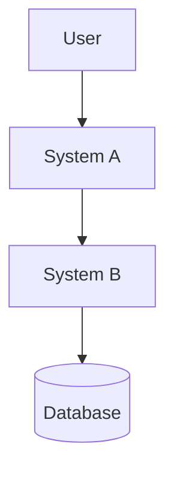
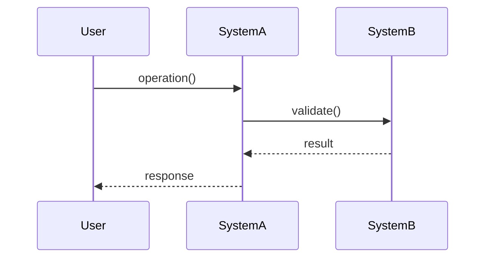

I have a complete specification following RootSpec v4.4.1.

Please read 00.SPEC_FRAMEWORK.md to understand the framework structure.

## My Specification

**Location:** {{SPEC_DIR}}/

**Systems (from 04.SYSTEMS/):**
{{#EACH SYSTEMS}}
- {{ITEM}}
{{/EACH}}
{{#IF NO_SYSTEMS}}
(No systems found - ensure you have Level 4 system specifications)
{{/IF}}

## What I Need

Derive a **Technical Design Document** from my Level 4 Systems specifications.

The output should include:
1. **Architecture diagrams** - System interconnections (Mermaid syntax)
2. **API specifications** - Endpoint definitions with contracts
3. **Data models** - Entity schemas and relationships
4. **Integration contracts** - Inter-system communication patterns
5. **Sequence diagrams** - Key flow visualizations

## Instructions

### PHASE 1: ANALYZE SYSTEMS

Read all Level 4 system files:

1. Start with `{{SPEC_DIR}}/04.SYSTEMS/SYSTEMS_OVERVIEW.md` to understand:
   - How systems interconnect
   - System boundaries and responsibilities
   - Cross-system dependencies

2. Read each individual system file in `{{SPEC_DIR}}/04.SYSTEMS/*.md`:
   - Extract entities and data structures
   - Identify rules and state transitions
   - Note inter-system relationships
   - Understand system responsibilities

3. Present your analysis:
   - List all systems with their primary responsibilities
   - Map system interconnections
   - Identify shared entities/concepts
   - Note any architectural patterns

Wait for confirmation before proceeding to Phase 2.

### PHASE 2: ARCHITECTURE DIAGRAMS

Create system architecture diagram in Mermaid syntax:

**Required elements:**
- All systems as boxes/components
- Data flow between systems
- External dependencies
- User interaction points

**Format:**


**Annotations:**
- Add `@spec_source: 04.SYSTEMS/SYSTEMS_OVERVIEW.md` comment
- Reference specific section/line from source spec

### PHASE 3: API SPECIFICATIONS

For each system that exposes APIs:

**Extract from system rules:**
- What operations does the system perform?
- What inputs does it require?
- What outputs does it produce?
- What validations are enforced?

**API Specification format:**

```
Endpoint: POST /api/system-a/operation
Source: @spec_source 04.SYSTEMS/SYSTEM_A.md#operations

Description: [Derived from system responsibility]

Request:
{
  "field": "type (from system entities)"
}

Response:
{
  "result": "type (from system state)"
}

Validation Rules: [From system rules section]
Error Cases: [From system failure modes]
```

### PHASE 4: DATA MODELS

Derive entity schemas from system documentation:

**For each entity mentioned in systems:**

```typescript
// @spec_source: 04.SYSTEMS/SYSTEM_NAME.md#entities
interface EntityName {
  field1: Type;  // From system entity description
  field2: Type;  // Referenced in system rules
}
```

**Relationships:**
- Map entity relationships across systems
- Define foreign keys for shared entities
- Document cardinality (1:1, 1:N, N:M)

### PHASE 5: INTEGRATION CONTRACTS

Define how systems communicate:

**For each inter-system relationship:**

```
Contract: System A → System B
Source: @spec_source 04.SYSTEMS/SYSTEMS_OVERVIEW.md#system-a-b-integration

Trigger: [Event or condition from specs]
Data Exchanged: [Entity/message format]
Guarantees: [Consistency requirements from specs]
Failure Handling: [Error modes from system docs]
```

### PHASE 6: SEQUENCE DIAGRAMS

For critical flows mentioned in systems:

**Create Mermaid sequence diagrams:**



**Annotate with:**
- `@spec_source` references to L4 docs
- Cross-references to L3 interaction patterns (if relevant)

### PHASE 7: DEVELOPMENT WORKFLOW CONSIDERATIONS

Ask the user about practical development workflow needs:

**Dev Server Management:**

Ask: "Should we implement scripts for managing the development server?"

Explain the benefit:
- Ensures only one dev server instance runs at a time
- Prevents port conflicts and resource wastage
- Provides consistent start/stop/status commands across team

If YES, identify:
- What commands are needed? (start, stop, status, restart)
- What should they do? (check for existing process, kill if needed, start fresh)
- Where should they live? (npm scripts, bash scripts, Makefile)
- What process management is needed? (PID files, port checking, etc.)

If NO, document why (e.g., using Docker, process manager handles it, etc.)

**Future Considerations Placeholder:**
- Database setup automation (coming soon)
- Environment management (coming soon)
- Testing infrastructure (coming soon)

Document findings in a separate deliverable (see Output Format below).

## Traceability Requirements

**Every derived element MUST:**
1. Include `@spec_source` comment with file path
2. Reference specific section/line when possible
3. Note alignment with L2 design strategies (if applicable)
4. Link to L3 interaction patterns (if flow-related)

**Example:**
```
// @spec_source: 04.SYSTEMS/AUTH_SYSTEM.md#login-flow (lines 45-67)
// @aligns_with: 02.STABLE_TRUTHS.md#security-first
// @implements: 03.INTERACTION_ARCHITECTURE.md#authentication-loop
```

## Output Format

Generate a single Technical Design Document with:

```markdown
# Technical Design Document

**Generated from:** RootSpec v4.4.1 specification
**Generated on:** [Date]
**Source:** {{SPEC_DIR}}/04.SYSTEMS/

## 1. System Architecture

[Mermaid diagram + description]

## 2. API Specifications

### System A
[Endpoints...]

### System B
[Endpoints...]

## 3. Data Models

[Entity schemas with relationships]

## 4. Integration Contracts

[Inter-system communication patterns]

## 5. Sequence Diagrams

### Critical Flow 1
[Mermaid sequence diagram]

### Critical Flow 2
[Mermaid sequence diagram]

## Traceability Matrix

| Artifact Section | Spec Source | Notes |
|-----------------|-------------|-------|
| ... | ... | ... |
```

---

### Additional Deliverable: Development Workflow Recommendations

Generate a separate document:

```markdown
# Development Workflow Recommendations

**Generated from:** RootSpec v4.4.1 specification
**Generated on:** [Date]
**Source:** Technical Design analysis

## Dev Server Management

**Recommendation:** [Implement scripts / Not needed]

**Rationale:** [User's reasoning]

**Requirements (if implementing):**
- Commands needed: [start, stop, status, restart]
- Implementation approach: [npm scripts / bash scripts / Makefile]
- Process management: [PID file / port checking / etc.]
- Expected behavior:
  - Start: [Check for existing process, start if not running]
  - Stop: [Find and kill process gracefully]
  - Status: [Report if running and on which port]
  - Restart: [Stop then start]

**Traceability:**
- Relates to systems: [List relevant L4 systems]
- Supports development of: [Specific features/flows]

---

## Future Considerations

_Reserved for:_
- Database setup automation
- Environment variable management
- Testing infrastructure setup
- CI/CD pipeline requirements
```

## Validation Checklist

Before delivering the Technical Design Document, verify:

- [ ] All systems from L4 are represented
- [ ] Every API endpoint traces to a system rule
- [ ] All entities match system entity definitions
- [ ] Integration contracts reflect SYSTEMS_OVERVIEW.md relationships
- [ ] Sequence diagrams match described flows
- [ ] Every section has `@spec_source` annotations
- [ ] Mermaid diagrams render correctly
- [ ] No invented features (only derive from spec)
- [ ] Development workflow considerations documented
- [ ] Dev server management decision recorded with rationale

---

**Note:** This is a derivation, not invention. Every design element must trace back to your Level 4 specifications. If something seems missing, note it as a gap in the spec rather than inventing new details.
