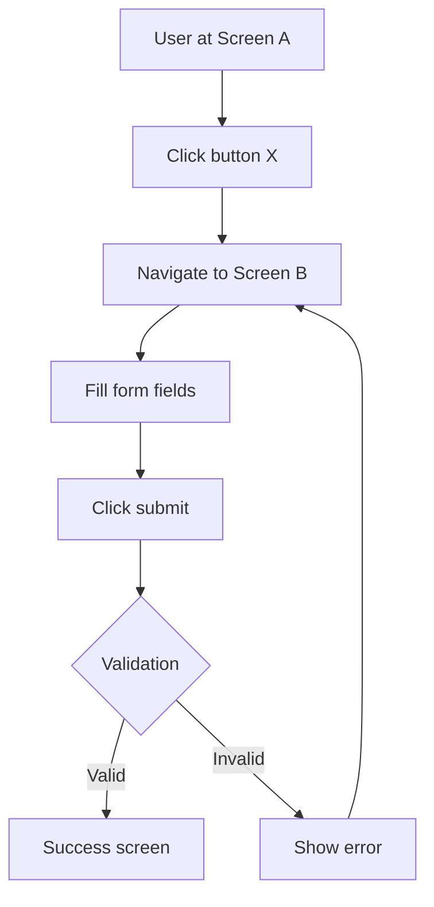

I have a complete specification following RootSpec v4.4.1.

Please read 00.SPEC_FRAMEWORK.md to understand the framework structure.

## My Specification

**Location:** {{SPEC_DIR}}/

**User Stories (from 05.IMPLEMENTATION/USER_STORIES/):**
{{#EACH USER_STORIES}}
- {{ITEM}}
{{/EACH}}
{{#IF NO_USER_STORIES}}
(No user stories found - ensure you have Level 5 USER_STORIES YAML files)
{{/IF}}

**Journeys found:**
{{#EACH JOURNEYS}}
- {{ITEM}}
{{/EACH}}
{{#IF NO_JOURNEYS}}
(No journeys found - user stories may not have @journey annotations)
{{/IF}}

## What I Need

Derive a **UX Design Document** from my Level 5 User Stories.

The output should include:
1. **User journey maps** - Flow through the product by journey
2. **Screen wireframe specifications** - Layout and component specs for each screen
3. **Interaction flow diagrams** - Sequence of screens and transitions
4. **Component inventory** - Reusable UI patterns across stories

## Instructions

### PHASE 1: ANALYZE USER STORIES

Read all YAML files in `{{SPEC_DIR}}/05.IMPLEMENTATION/USER_STORIES/`:

1. **Extract screen inventory:**
   - List all unique screens visited (from `visit` steps)
   - Note screen purpose from story context
   - Identify entry/exit points

2. **Map journeys:**
   - Group stories by `@journey` annotation
   - Identify journey entry points and completion states
   - Note decision points within journeys

3. **Identify interaction patterns:**
   - Form submissions (sequences of `fill` + `click`)
   - Navigation flows (sequences of `visit`)
   - CRUD operations (create/read/update/delete patterns)
   - Authentication flows (`loginAs` patterns)

4. **Note shared components:**
   - Repeated UI elements across stories
   - Common form fields (from `fill` steps)
   - Common buttons/actions (from `click` steps)
   - Common content displays (from `shouldContain` assertions)

5. **Present your analysis:**
   - List all unique screens
   - List all journeys with story count
   - Identify key interaction patterns
   - Note component repetition

Wait for confirmation before proceeding to Phase 2.

### PHASE 2: MAP USER JOURNEYS

For each journey (from `@journey` annotations):

**Journey Map Format:**

```markdown
### Journey: [Journey Name]

**Source:** @spec_source 05.IMPLEMENTATION/USER_STORIES/[file].yaml

**User Goal:** [Inferred from story descriptions]

**Journey Flow:**
1. Entry Point: [First screen visited]
2. [Key step] → [Screen/action]
3. [Key step] → [Screen/action]
4. Completion: [Final state/screen]

**Decision Points:**
- [Condition] → [Path A] or [Path B]

**User Stories in Journey:**
- [Story 1 title]
- [Story 2 title]
```

**Requirements:**
- Map complete flow from entry to completion
- Note branching points (conditional flows)
- Link to source YAML files
- Include success and error paths

### PHASE 3: DEFINE SCREEN SPECS

For each unique screen identified:

**Screen Specification Format:**

```markdown
### Screen: [Screen Name/Path]

**Source:** @spec_source 05.IMPLEMENTATION/USER_STORIES/[file].yaml (lines [X-Y])

**Purpose:** [Derived from story context]

**Layout Description:**
- [Primary content area]
- [Secondary elements]
- [Navigation elements]

**Interactive Elements:**
- **Buttons:**
  - [Button name] - [Action from click step]
- **Forms:**
  - [Field name]: [Type from fill step]
- **Links:**
  - [Link text] - [Destination]

**Data Displayed:**
- [Content from shouldContain assertions]
- [Lists/tables of data]

**User Actions:**
- [Primary action]
- [Secondary actions]
- [Navigation options]

**States:**
- Default state
- Loading state (if applicable)
- Error state (if applicable)
```

**Requirements:**
- Derive layout from test assertions
- List all interactive elements from test steps
- Document data from `shouldContain` steps
- Note different states if tested

### PHASE 4: DOCUMENT INTERACTION FLOWS

Create flow diagrams for key interactions:

**Flow Diagram Format (Mermaid):**



**Create flows for:**
- Happy path flows (from user stories)
- Error handling (from validation assertions)
- Navigation patterns (from visit sequences)

**Annotations:**
- Add `@spec_source` comments
- Reference specific YAML file and lines
- Link to journey maps

### PHASE 5: COMPONENT INVENTORY

List reusable UI components found across stories:

**Component Inventory Format:**

```markdown
### Component: [Component Name]

**Source:** @spec_source Multiple stories (see usage below)

**Purpose:** [What it does]

**Props/Inputs:**
- [Input 1]: [Type/description from fill steps]
- [Input 2]: [Type/description]

**Behavior:**
- [Action 1]: [From click steps]
- [Validation]: [From assertions]

**Usage Across Stories:**
- Story: [Story 1] - [File].yaml
- Story: [Story 2] - [File].yaml

**Examples from Tests:**
```yaml
# From story-name.yaml
when:
  - fill: "component-field" with: "value"
  - click: "component-action"
```
```

**Components to identify:**
- **Forms** - Repeated sets of fill steps
- **Buttons** - Common click targets with similar text
- **Lists/Tables** - Repeated shouldContain patterns for collections
- **Modals/Dialogs** - Patterns of appear/interact/dismiss
- **Navigation** - Common visit patterns or menu interactions

### PHASE 6: TRACEABILITY

Create traceability matrix linking UX artifacts to source:

**Traceability Matrix:**

| UX Artifact | Type | Source YAML File | Lines | Journey | Priority |
|-------------|------|------------------|-------|---------|----------|
| Login Screen | Screen | auth/login.yaml | 10-25 | Authentication | MVP |
| User Flow | Flow | onboarding/*.yaml | - | Onboarding | MVP |
| Form Component | Component | Multiple | - | - | - |

**Requirements:**
- Every screen links to YAML file
- Every flow references source stories
- Components list all usage locations
- Include priority from `@priority` annotations

## Output Format

Generate a single UX Design Document:

```markdown
# UX Design Document

**Generated from:** RootSpec v4.4.1 specification
**Generated on:** [Date]
**Source:** {{SPEC_DIR}}/05.IMPLEMENTATION/USER_STORIES/

## 1. User Journey Maps

[Journey maps for each @journey]

## 2. Screen Specifications

### MVP Screens
[Screens from MVP stories]

### Post-MVP Screens
[Screens from POST_MVP stories]

## 3. Interaction Flows

[Mermaid diagrams for key flows]

## 4. Component Inventory

[Reusable components identified]

## 5. Traceability Matrix

[Table linking artifacts to source YAML]

## 6. Implementation Notes

**Screens by Priority:**
- MVP: [count] screens
- POST_MVP: [count] screens

**Complexity Indicators:**
- Complex forms: [screens with 5+ fields]
- Multi-step flows: [journeys spanning 3+ screens]
- Dynamic content: [screens with lists/tables]

**Next Steps:**
- Prioritize MVP screens for design mockups
- Define component library requirements
- Plan responsive layout breakpoints
```

## Validation Checklist

Before delivering the UX Design Document, verify:

- [ ] All user stories are represented
- [ ] Every screen has specification derived from tests
- [ ] All journeys map to actual story sequences
- [ ] Components identified from repetition (not invented)
- [ ] Every artifact has `@spec_source` annotation
- [ ] Mermaid diagrams render correctly
- [ ] Traceability matrix is complete
- [ ] No invented features (only derive from YAML)
- [ ] Priority levels preserved from stories
- [ ] Error flows documented where tested

---

**Note:** This is a derivation, not invention. Every UX element must trace back to your Level 5 user stories. If a screen or flow seems needed but isn't tested, note it as a gap rather than inventing details.
